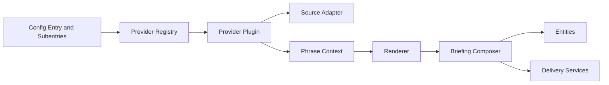

# Provider Plugin Architecture

## Goal

The User Briefing integration should be modular by construction, not by convention. Content providers must be addable or replaceable with minimal blast radius, and the core briefing engine must remain stable as provider count grows.

## Design Principles

- The core owns orchestration, never source-specific business logic.
- Providers own snippet semantics, never whole-briefing flow.
- Adapters own source access, never phrase rendering.
- Rendering owns wording, never upstream data fetching.
- Delivery owns output channels, never provider internals.
- Alert promotion rules belong to the core, while alert detection belongs to providers.

## Layered Model

## Core modules

Suggested module responsibilities:

- `providers/contracts.py`
  - base dataclasses, enums, and protocol interfaces
- `providers/registry.py`
  - registration, lookup, capability metadata, API version checks
- `adapters/*.py`
  - normalized access to upstream integrations and Home Assistant building blocks
- `rendering.py`
  - phrase selection and interpolation
- `coordinator.py`
  - execution planning, caching, failure isolation, refresh control

## Provider metadata

Every provider should declare metadata that the UI and runtime can inspect.

Suggested metadata fields:

- `key`
- `name`
- `version`
- `provider_api_version`
- `supports_multiple_instances`
- `supports_preview`
- `supports_required_priority`
- `supports_actions`
- `supports_deep_link`
- `supports_dashboard_card`
- `supports_alerts`
- `default_order_group`
- `dependencies`

This avoids duplicated hardcoded knowledge across config flow, services, and docs.

## Provider lifecycle

Suggested lifecycle:

1. registry resolves provider by key
2. provider validates snippet config
3. provider requests data via adapter or Home Assistant service call
4. provider normalizes raw payload
5. provider derives zero or more structured alerts
6. provider selects scenario key
7. provider builds phrase context
8. renderer builds the final snippet text
9. composer assembles snippet results into final briefing and promotes alerts

## Snippet typing strategy

Keep user-facing snippet types stable even if adapters change.

Examples:

- snippet type `beach_conditions`
  - adapter `ha_catalunya_beaches`
- snippet type `task_summary`
  - adapter `homeassistant_todo`
  - adapter `todoist_via_homeassistant`
  - adapter `microsoft_todo_via_homeassistant`
- snippet type `mail_summary`
  - adapter `stub`, later `gmail`, `imap`, or `graph`

This lets a user keep the same briefing purpose while switching implementation underneath.

## Configuration strategy

Each provider should supply its own config schema builder so the subentry flow can ask the registry for the relevant form.

Suggested pattern:

- common subentry fields are owned by the core
- provider-specific fields come from the provider metadata and schema builder

Common fields:

- enabled
- order
- priority
- title override

Provider-specific fields:

- entity targets
- list or source selectors
- location filters
- summary depth
- phrase style overrides if allowed

For task summaries, selectors should prefer Home Assistant task or to-do entities and not ask the user to reconfigure upstream account details inside this integration.

## Execution strategy

The composer should operate over a list of provider instances with no direct knowledge of their concrete classes.

Rules:

- providers execute independently
- failures are collected, not thrown through the whole pipeline
- optional snippets can be skipped on empty
- required snippets render fallback output when possible
- provider runtime metrics should be captured for diagnostics
- provider alerts are collected separately from their normal snippet body so the core can promote them consistently

Dashboard fragment generation should follow the same isolation rules. A provider lacking dashboard support should not block dashboard assembly for other providers.

## Replaceability rules

A provider is considered properly modular only if all of the following are true:

- adding a provider does not require changes in composer branching logic
- replacing an adapter does not require changing phrase-bank or delivery code
- disabling a provider leaves other providers unaffected
- provider-specific actions are surfaced via a common action payload contract
- provider-specific dashboard fragments are surfaced via a common dashboard fragment contract
- provider-specific alerts are surfaced via a common alert contract

## Alert contract

Providers that support alerts should emit structured alert items rather than embedding all attention-grabbing behavior into free text.

Suggested alert fields:

- `alert_key`
- `provider_key`
- `severity`
- `title`
- `text`
- `source_label`
- `navigation_path`
- `meta`

The core should sort and render alerts ahead of normal snippet content.

## Dashboard fragment contract

Providers that support dashboard output should be able to describe one or more reusable card fragments.

Suggested fragment fields:

- fragment key
- recommended title
- target entity ids
- default card type
- optional chips or badges
- optional navigation path
- compatibility notes

The core should not hardcode card YAML per provider. It should compose provider-declared fragments into per-user dashboard templates.

## Future-proofing

The architecture should support future evolutions without redesign:

- external provider packs
- richer notification action builders
- voice-invokable briefing scripts
- user-imported phrase packs
- per-user ranking or suppression rules

Notification logic in v1 should remain stubbed at the interface layer. Define the contracts now so future implementation does not require refactoring provider or dashboard layers.

## Recommended implementation stance

For v1, ship only built-in providers and internal adapters, but enforce the same registry and contract shape you would need for third-party modules later. That gives you modularity immediately without taking on premature extension-distribution complexity.